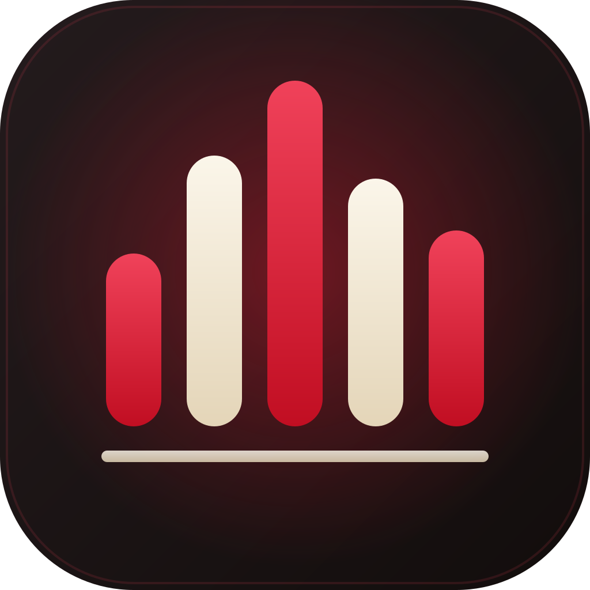

<p align="center">
  
</p>

# SemperSounds

A self-hosted Discord soundboard without the sound limit.

Discord caps how many sounds a server's built-in soundboard can hold. This replaces it: a
bot joins your voice channel, and a web page lets anyone in that channel fire uploaded
clips into it. Sounds overlap the way the real soundboard does, and everything is logged.

It also does the two things Discord charges for or does not do at all: a personal **entry
sound** when you walk into voice, and **play counts** you can sort and filter the whole
board by.

There is a **[Windows app](#windows-app)** as well, so you can fire clips with a hotkey
without alt-tabbing out of a game.

- **Backend:** .NET 10 + [NetCord](https://netcord.dev) (gateway and voice)
- **UI:** Blazor Web App (InteractiveServer) + [MudBlazor](https://mudblazor.com)
- **Storage:** SQLite + files on a mounted volume
- **Desktop:** Avalonia + [SukiUI](https://github.com/kikipoulet/SukiUI), talking to the
  server over SignalR
- **Audio:** ffmpeg at upload time only

## How it works

| Thing | Behaviour |
|---|---|
| Which channel | The bot joins whatever voice channel the person pressing **Join** is in |
| Who may play | Only people currently in the bot's voice channel |
| Who may upload/delete | Anyone in the server |
| Overlapping sounds | They mix, like the real soundboard. **Stop all** silences everything |
| Upload limit | 5 seconds of kept audio (0.25s tolerance for encoder padding), 10 MB |
| Longer files | Fine — trim them in the browser on a waveform before uploading. Sources up to 5 minutes |
| Loudness | Normalized at upload, so no clip is ten times louder than the rest |
| Finding things | Live search over names, tags and emoji, plus tag filters. Tags autocomplete against those already in use, so near-duplicates do not pile up |
| Sorting | A–Z, most played, newest, recently played, longest or shortest. Your choice is remembered in your browser |
| Filtering | By uploader, favourites only, never played, or untagged — all combining with search and tags |
| Play counts | Shown on each tile, counted from the log you already have, so they are meaningful immediately rather than starting at zero |
| Emoji | Every sound carries one — your server's custom emoji or any standard one — and search matches it, including a custom emoji's name |
| Favourites | Each person stars up to 9 sounds and plays them with keys 1–9 |
| Entry sounds | Each person picks a clip that plays when they walk into the channel the bot is already in |
| Leaving | The bot drops out a few seconds after the last human leaves the channel |
| Log | Sounds played, entry sounds fired, plus who summoned the bot and when it left |

Uploads are converted once at upload into raw 48 kHz stereo PCM plus a normalized mp3
preview. Playback then never spawns a process — it reads ~1 MB off disk and mixes it.

## Entry sounds

Everyone picks one clip from the board at `/entry-sound`, and it plays when they walk into
voice. The bot is **passive about this**: it never joins a channel on its own to play one.
If it is not already sitting where you arrived, nothing happens — which is what stops it
being dragged out of a channel people are using, and stops a connect handshake delaying
every clip.

It also stays quiet when you are the only one there, when you have muted yourself, and for
a while after it last played for you, so leaving and rejoining is not a weapon.

Anyone with the Discord **Administrator** permission gets `/admin/entry-sounds`:

| Control | What it is for |
|---|---|
| On/off | The blunt instrument |
| Snooze | Quiet for 1–8 hours and back on by itself, so nobody has to remember |
| Silence one person | Their entry sound stops; everyone else's keeps working. They can see the reason |
| Volume | Entry sounds sit under conversation instead of over it. Board presses are unaffected |
| Cooldown and length cap | Editable live instead of by redeploying. The length cap applies when somebody picks, so tightening it never silently unassigns anyone |

Those settings live in the database, so they survive restarts. Permissions are read from
Discord live rather than from your login, so promoting somebody takes effect immediately
instead of when they next sign in.

## Stats

Play counts come from the activity log rather than a counter column, which means they
cover every play the log has ever held rather than starting from the day the feature
shipped. Only deliberate button presses count — an entry sound firing does not inflate its
clip's ranking.

`/stats` has the totals, the top ten sounds, who presses the most buttons, and plays per
day over the last week, fortnight or month. Deleted sounds stay in the rankings, marked, so
the totals still add up.

A clip's tile shows a flame instead of a play icon when it is **trending** — played more in
the last seven days than the seven before, with at least five plays this week. That is a
rise rather than a rank, so a perennial favourite at a steady rate does not wear one
forever. Clicking the count opens its history: total plays, first and last, and who plays
it most.

## Windows app

[**Download SemperSounds.Desktop.exe**](https://github.com/alkobottle/SemperSounds/releases/latest)
— one file, about 25 MB, no runtime to install. It keeps its settings in
`%APPDATA%\SemperSounds` and runs from wherever you put it.

It is a **remote control, not a second soundboard**. Pressing a key asks the server to play
the clip through the same bot, so the same rules apply: you have to be in the bot's channel,
the same cooldown paces you, and the press lands in the log and the play counts exactly as
a click on the board does.

| Thing | Behaviour |
|---|---|
| Pairing | Opens your browser, you approve it, and the app gets a device token. Manage or revoke them at `/devices` |
| Hotkeys | Any key or combination. `F13`–`F24` on a macro keyboard are the safest, since no game uses them |
| Pass-through | A bound key **still does its normal job** — bind `F1` and F1 still opens your game's help |
| Auto-summon | If the bot is elsewhere when you press, the app summons it to you and plays. Switch it off if you would rather it did not |
| Extra keys | Stop everything, summon/dismiss the bot, and mute the app so you can type in a game chat. All unbound by default |
| Preview | Headphones plays a clip **to you only**, so auditioning the library does not fire it at everybody |
| Now playing | Shows what is sounding and who set it off, entry sounds included |
| Tray | Closing the window hides it; quitting is the tray menu. Optionally starts with Windows |

### Why hotkeys sometimes do nothing

The app watches the keyboard with a low-level hook rather than registering hotkeys, which
is what lets a bound key keep working everywhere else. Two consequences:

- **Games running as administrator.** Windows will not let a normal program see keys going
  to an elevated window, which is most games with kernel anti-cheat. The app notices and
  offers to restart itself elevated.
- **Anti-cheat.** A global keyboard hook is a pattern some anti-cheat software dislikes.
  Nothing can be done about that from this side.

The on-screen popup also cannot draw over a game in **exclusive** fullscreen — nothing can.
That is why there is a sound cue as well, which always works. Both are off until you turn
them on.

### Building it yourself

```bash
pwsh tools/publish-desktop.ps1        # -> dist/desktop/SemperSounds.Desktop.exe
```

Published self-contained, single-file and trimmed. Trimming disables reflection-based JSON,
so everything that crosses the wire has a source-generated serializer context — adding a
serialised type without adding it to one breaks the app on first use of that path, not at
build time.

## Discord setup

At <https://discord.com/developers/applications>:

1. **New Application.**
2. **Bot → Reset Token** → this is `Discord__BotToken`. It is not the client secret.
3. **OAuth2** → copy Client ID and Client Secret.
4. **OAuth2 → Redirects** → add `https://your-domain/signin-discord`
   (and `http://localhost:5219/signin-discord` for local development).
5. **Bot → Privileged Gateway Intents → enable Server Members Intent.** Self-enablable
   below 100 servers, no review needed. **Do not skip this**: without it Discord sends an
   effectively empty member list, so avatars and nicknames never resolve, the bot counts
   itself as a listener and never auto-disconnects from an empty channel, and nobody's
   roles can be read — which means nobody is recognised as an administrator and the entry
   sound settings page is unreachable. Presence and Message Content stay off.
6. **Invite the bot** with the `bot` scope and the **Connect** and **Speak** permissions.
7. In Discord, enable Developer Mode, right-click your server → **Copy Server ID** →
   this is `Discord__GuildId`.

## Running with Docker

```bash
cp .env.example .env      # fill in the four Discord values and your public URL
./deploy.sh               # pulls, rebuilds, and reports what went live
```

`deploy.sh` stamps the image with the commit it was built from. Building by hand skips
that, and the version then reads `unknown`:

```bash
GIT_COMMIT=$(git rev-parse --short HEAD) docker compose up -d --build
```

### Which version is live

The running commit appears at the foot of every page, and unauthenticated at `/healthz`:

```bash
curl -s https://your-domain/healthz
# {"status":"ok","version":"eb254a6","builtAt":"2026-08-09T18:33:21Z"}
```

`builtAt` distinguishes rebuilds of the same commit; `dev` means it was not built through
Docker at all.

The container listens on `127.0.0.1:8080` and expects a reverse proxy in front of it to
terminate TLS. Point your proxy at it and make sure it sets `X-Forwarded-Proto`.

Sounds, the database and the Data Protection keys live in `./data`, mounted at `/data`.
**Back this up** — deleting it deletes every uploaded sound, and discarding the keys signs
everyone out.

### Behind the proxy

Set `App__PublicBaseUrl` to the https URL users actually visit. Without it the app builds
an `http://` OAuth redirect URI and Discord refuses the login — the most common way this
deployment goes wrong.

## Local development

```bash
cp src/SemperSounds.Web/appsettings.Development.example.json \
   src/SemperSounds.Web/appsettings.Development.json
# fill in the Discord values, then:
dotnet run --project src/SemperSounds.Web
```

**ffmpeg and ffprobe must be on your PATH** for uploads to work locally. The container
already has them. On Windows: `winget install Gyan.FFmpeg`.

### Native voice libraries

NetCord calls into three native libraries, and voice fails at runtime without them:

| Library | Where it comes from | Why |
|---|---|---|
| libdave | `libdave` NuGet package | Discord's E2EE voice protocol. NetCord loads it unconditionally — there is no way to turn it off, and it is not in any Linux distro repo. |
| libsodium | `libsodium` NuGet package | Voice encryption. Official package by libsodium's author. |
| opus | `OpusDotNet.opus.win-x64` on Windows, `libopus-dev` in the container | Opus encoding of voice frames. |

All three ship as `runtimes/<rid>/native/` assets, so a plain `dotnet run` picks them up.
In the container, opus comes from apt: use `libopus-dev` and not `libopus0`, since the
latter installs only `libopus.so.0` while .NET probes for the unversioned `libopus.so`.

Leave `App__PublicBaseUrl` empty in development so Kestrel's own URL is used.

```bash
dotnet test            # unit tests, no Discord or ffmpeg required
```

## Bulk import

Useful for migrating an existing Discord soundboard, where uploading by hand would mean
re-entering every name and emoji.

Put the audio files and a `manifest.json` in a folder, drop it under the data volume
(`./data/import`), and run the importer from the running container — it needs the ffmpeg
the image already carries:

```bash
docker compose exec sempersounds dotnet SemperSounds.Import.dll /data/import --dry-run
docker compose exec sempersounds dotnet SemperSounds.Import.dll /data/import
```

`manifest.json` is an array of:

```json
[{ "file": "01_airhorn.mp3", "name": "Airhorn", "emoji": "📣",
   "tags": "meme, loud", "uploaderId": "277501102943895552", "uploaderName": "alkobottle" }]
```

`emoji` takes either a standard emoji or Discord's `<:name:id>` form. Imports run through
the same validation and loudness normalization as the web upload, and skip any name that
already exists, so re-running is safe.

### Exporting a Discord soundboard

The bot can list the guild's sounds itself; the audio downloads from the CDN even for
sounds the server can no longer play because its boosts lapsed:

```bash
curl -H "Authorization: Bot $TOKEN" \
  https://discord.com/api/v10/guilds/$GUILD_ID/soundboard-sounds
curl -o sound.mp3 https://cdn.discordapp.com/soundboard-sounds/$SOUND_ID
```

Custom emoji come back with `emoji_id` and a null `emoji_name`, so the names have to be
resolved separately from `/guilds/{id}/emojis`.

## Configuration

Every setting binds from the config file in development and from environment variables in
the container — `Soundboard__MaxDurationSeconds` is the same knob as the nested JSON key.

| Variable | Default | Meaning |
|---|---|---|
| `Discord__BotToken` | — | Bot token (required) |
| `Discord__ClientId` / `Discord__ClientSecret` | — | OAuth2 credentials (required) |
| `Discord__GuildId` | — | The one server this instance serves (required) |
| `App__PublicBaseUrl` | empty | Public https URL; required behind a proxy |
| `Soundboard__DataPath` | `/data` | Where sounds and the database live |
| `Soundboard__MaxDurationSeconds` | `5` | Length limit on the audio that is *kept* |
| `Soundboard__MaxSourceDurationSeconds` | `300` | Longest file accepted for trimming |
| `Soundboard__MaxUploadBytes` | `10485760` | Upload size limit |
| `Soundboard__PerUserCooldownSeconds` | `0` | Anti-spam delay between plays, per user |
| `Soundboard__IdleLeaveSeconds` | `5` | Auto-disconnect this long after the last human leaves. `0` disables |
| `Soundboard__DurationToleranceSeconds` | `0.25` | Slack on the length limit; encoders pad, so a clip authored at 5.00s often probes at 5.02s |
| `Soundboard__FfmpegPath` / `Soundboard__FfprobePath` | `ffmpeg` / `ffprobe` | Override if they are not on `PATH` |
| `Soundboard__TranscodeTimeoutSeconds` | `60` | Kills a stuck ffmpeg run |

Entry sounds are deliberately **not** configured here. Their on/off switch, snooze, volume,
cooldown and length cap live in the database and are edited at `/admin/entry-sounds`, so
changing them does not mean a redeploy. `Soundboard__PerUserCooldownSeconds` above throttles
board presses only and is a separate knob from the entry sound cooldown — sharing one would
mean pressing a button silenced your own entry sound.

## Layout

```
src/SemperSounds.Core/     Domain: PcmMixer, upload validation, ffmpeg wrappers, EF model
                           EntrySounds/  who has which entry sound, and the rules for playing it
                           Statistics/   play counts and rankings, aggregated from the log
src/SemperSounds.Web/      Blazor UI, Discord gateway + voice, auth, the desktop hub
src/SemperSounds.Contracts/    Wire types shared by the server and the Windows app
src/SemperSounds.Desktop.Core/ The app's decisions: hotkey chords, config, retrigger rules
src/SemperSounds.Desktop/      Avalonia window, tray icon, keyboard hook, Win32 interop
tools/SemperSounds.Import/ Bulk importer, published into the same image
tests/SemperSounds.Tests/  Unit tests, including the desktop app's logic
```

| Page | What it is |
|---|---|
| `/` | Public landing page carrying the link-preview card |
| `/board` | The soundboard |
| `/upload` | Add a sound, trimming it on a waveform first |
| `/entry-sound` | Your entry sound, and everyone else's |
| `/admin/entry-sounds` | Entry sound controls, Discord administrators only |
| `/log` | Everything that happened, newest first |
| `/stats` | Play counts, rankings and a plays-per-day chart |
| `/devices` | Windows apps paired to your account, and a button to revoke them |

Everything except `/` requires sign-in, which requires being in the server.

The mixer, upload validator, entry sound rules, board sorting and play statistics all live
outside the pages specifically so they can be tested without a Discord connection or a
browser — there is no bUnit here, so anything left inside a `.razor` file is untestable.

`SemperSounds.Desktop.Core` exists for the same reason and one more: it targets plain
`net10.0` rather than `net10.0-windows`, which is what lets the one existing test project
reference it. Everything the app *decides* lives there; everything it *draws or calls
Win32 for* lives in `SemperSounds.Desktop`, which has no tests.
